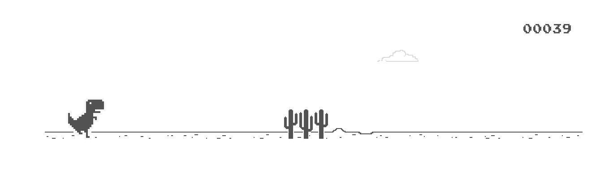

# react-dino-game

A React component for the classic Google Chrome Dinosaur Game (T-Rex Runner). 
Originally extracted from Chromium, this game has been packaged as a modern, easy-to-import React component with full TypeScript support.



## Installation

Install via npm:

```bash
npm install @a7mddra/react-dino-game
```

## Usage

Simply import the component and the accompanying styles, and render it anywhere in your application. 

```jsx
import React from 'react';
import ChromeDinoGame from '@a7mddra/react-dino-game';
import '@a7mddra/react-dino-game/dist/style.css';

export default function App() {
  return (
    <div style={{ padding: '2rem' }}>
      <h1>My App</h1>
      
      {/* Render the game component */}
      <ChromeDinoGame />
    </div>
  );
}
```

> **Note:** The game is styled to fit within its container. For the best experience, wrap it in a container with a defined width.

## Local Development

If you'd like to run this repository locally to test or contribute:

1. Clone the repository
2. Install dependencies:
   ```bash
   npm install
   ```
3. Start the Vite dev server (this will run the `src/demo` app):
   ```bash
   npm run dev
   ```
4. To build the library for production:
   ```bash
   npm run build
   ```

## License

MIT
